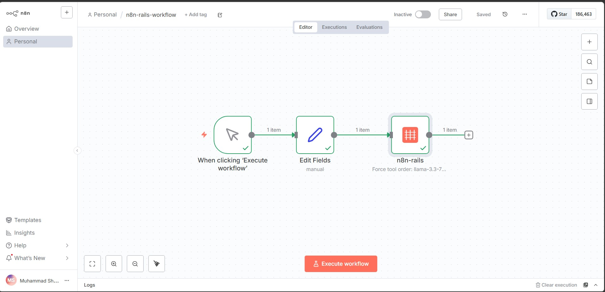
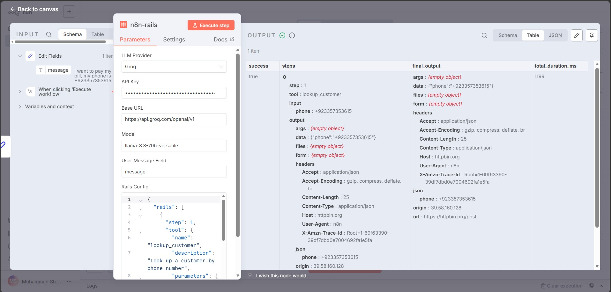

## Screenshots

**The workflow on n8n canvas:**



**Step-by-step output (proof it works):**



## Install

```bash
npm install n8n-nodes-rails
```

Or in your n8n instance: Settings → Community Nodes → search `n8n-nodes-rails` → install.

n8n version 1.20 or higher.

## Quick start

1. Drop the n8n-rails node into your workflow before any AI Agent node
2. Set your LLM provider (OpenAI, Groq, or any OpenAI-compatible)
3. Define your tool order in the Rails Config JSON:

```json
{
  "rails": [
    {
      "step": 1,
      "tool": {
        "name": "lookup_customer",
        "description": "Look up a customer by phone",
        "parameters": {
          "type": "object",
          "properties": {
            "phone": { "type": "string" }
          },
          "required": ["phone"]
        },
        "endpoint": {
          "url": "https://your-api.com/customers/lookup",
          "method": "POST",
          "headers": { "Authorization": "Bearer YOUR_TOKEN" }
        }
      },
      "on_fail": "halt"
    }
  ]
}
```

4. Connect a trigger and a Set node that creates a `message` field
5. Execute. The LLM cannot skip your steps anymore.

## How it compares

| Feature                    | Vanilla n8n AI Agent | n8n-rails             |
|----------------------------|----------------------|-----------------------|
| Tool order                 | Hope the prompt works | Locked, cannot skip   |
| Hallucination handling     | Sends bad data       | Halts or retries      |
| Production safe?           | For demos            | For client work       |

## How is this different from n8n's native Guardrails?

The native Guardrails node validates the CONTENT of text (NSFW, prompt injection, PII). It does not enforce tool execution order.

n8n-rails forces deterministic execution flow at the orchestration layer. Different problem, different solution. They are complementary, not competing.

## Roadmap

- [x] v0.1: Forced tool execution order (Rails)
- [ ] v0.2: Zod validation between steps (Bouncers)
- [ ] v0.3: Multi model retry and failover (Safety Nets)
- [ ] v0.4: Step-by-step replay UI (Tape)
- [ ] v0.5: Portable TypeScript engine for LangChain and CrewAI users

## Why I built this

I am Muhammad Shaheer, n8n Verified Creator with 100+ workflows shipped. I build agentic AI systems for clients in US, UK, and Pakistan. I have been burned by exactly this problem in three different production projects. Prompt engineering does not solve probabilistic models meeting deterministic business logic. Code does.

If you find this useful, the best thank you is starring the repo and sharing with one other n8n builder.

## Contributing

PRs welcome. If you have lost money or sleep to an LLM hallucinating an API call in production, I want your help.

1. Fork the repo
2. Branch off main: `git checkout -b feature/your-thing`
3. Commit your work
4. Open a PR

## License

MIT © [Muhammad Shaheer](https://github.com/masteranime)
